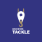

# Tackle documentation

This repository contains the files for Tackle documentation. Tackle is part of the [Konveyor project](https://www.konveyor.io/).

[Tackle](https://github.com/konveyor/tackle) is a collection of tools that support the modernization and migration of applications to Kubernetes. The tools are microservices, which are accessible from a common [Tackle UI](https://github.com/konveyor/tackle-ui/).  

* [Tackle Application Inventory](https://github.com/konveyor/tackle-application-inventory) allows users to maintain their portfolio of applications, to link them to the business services that they support, and to define their interdependencies. The Application Inventory uses an extensible tagging model to add metadata. The Application Inventory is used to select an application for an assessment by Pathfinder.

* [Tackle Pathfinder](https://github.com/konveyor/tackle-pathfinder) is an interactive, questionnaire-based tool that assesses the suitability of applications for modernization so that they can be deployed in containers on an enterprise Kubernetes platform. The tool generates reports about an application’s suitability for Kubernetes, the associated risks, and creates an adoption plan.

* [Tackle Controls](https://github.com/konveyor/tackle-controls) are a collection of entities that add value to Application Inventory and the Pathfinder assessment. They comprise business services, stakeholders, stakeholder groups, job functions, tag types, and tags.  

* [Tackle DiVA](https://github.com/konveyor/tackle-diva) is a data-centric application analysis tool. It imports a set of target application source files and provides database/transaction analysis results.

## Submitting issues

You can submit issues at [konveyor/tackle-operator/issues](https://github.com/konveyor/tackle-operator/issues).

## Contributing to Tackle documentation

This project is [Apache 2.0 licensed](LICENSE) and accepts contributions via
GitHub pull requests.

See the [Contributors Guide](CONTRIBUTING.adoc) for details.

## Code of conduct

## PR preview rendering

